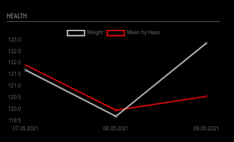
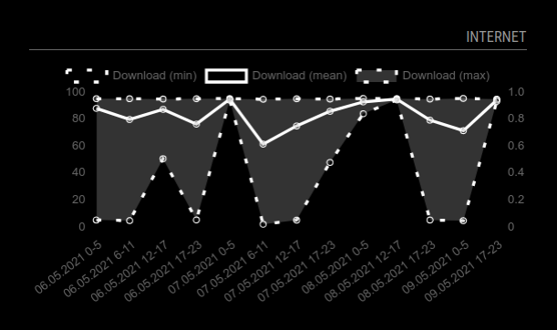

**This is a work in progress. Please submit any issues via GitHub.**

# MMM-HASS-Chart

This an extension for the [MagicMirror²](https://magicmirror.builders/) with an interface for [Home Assistant](https://www.home-assistant.io/).

The modules adds graphs to your mirror using sensor data from Home Assistant.

   

# Installation

In your terminal, go to your MagicMirror's Module folder:
````
cd ~/MagicMirror/modules
````

Clone this repository:
````
git clone https://github.com/MariusHerget/MMM-HASS-Chart
````

Run npm install:
````
cd MMM-HASS-Chart
npm install
````
### Using the module

See some examples below.
 
There are ALOT of configuration options for this module. See below.

OBS: You have to set the width of the graph (with your graph name) in the custom.css file, otherwise you will not see anything!

Like so:

````css
.my-chart {
	width: 355px;
}
````

# Configugration
## Home Assistant Server settings
Enter your Home Assistant configuration:
``` 
host: "localhost",
port: "8123",
https: false,
``` 

## Home Assistant Token
Save the Home Assistant _Long-Lived Access Token_ (see Profile) in environment `process.env.HASSIO_TOKEN`.

_For testing purposes it is possible to save the token in the config as well (`token: "hass-token"`)_


## Data time options
Enter  the options which data should be requested from Home Assistant history API endpoint.

Start and end days can be used to dynamicly calculate the timestamps.
- **start_days**: today - _x_*days
- **end_days**: today - _x_*days

You can enter manually timestamps in the ISO format with. Days are overriting timestamps.
``` 
start_days: "31",
start_timestamp:  "2021-05-07T08:29:00.339473+00:00",
end_days: "0",
end_timestamp: "2021-05-07T10:59:00.339473+00:00",
``` 

## Data transformation options
Since Home Assitant historical data from sensors are difficult to display directly in a chart there are some options on how to group them:

`groupBy`: 
- **byHour**
- **byMinute**
- **bySecond**
- **bySixHours** (0-5, 6-11, 12-17, 17-23)
- **byDay**
- **byMonth**
- **byWeek**
- **byYear**
- **custom**: 
   - Define a custom function to be applied by lo_dash (`_.groupBy(data, customFunction);`)
   - e.g. `customGroupBy: (item) => { return moment(item.x).format('MM-YYYY'); }`

Since there can be multiple data entries in a group, those must be aggregated.

`aggregateFunc`:
- **mean**
- **max**
- **min**
- **sum**
- **median**
- **custom**: 
   - Define a custom function to aggreagte the states of a group
   - e.g. `customAggregateFunc: (data) => { return  _.sumBy(data, (item) => item.y)/data.length*2; }`
   - *// TODO: Better example necessary //*
- **minMeanMax**:
  - Automaticly generates three lines for min, mean, and max.
  - Color is defined by `backgroundColor`. If this is not defined it uses `borderColor` with an opacity of `0.2`.
  
``` 
groupBy: "byHour",
customGroupBy: () => { ... }, // only used when groupBy is set to custom

aggregateFunc: "mean",
customAggregateFunc: () => { ... } , // only used when aggregateFunc is set to custom
``` 
   
## Module chart options
Currently this module is only tested for line charts.
``` 
fadeSpeed: 1000,
chartType: "line",
updateInterval: 60 * 1000, // every 60 seconds
``` 

## ChartJs options
This module supports the ChartJs framework completly. In `chartOptions` you can set up the general chart options (see [ChartJS documentation](https://www.chartjs.org/docs/latest/configuration/responsive.html)).
``` 
chartOptions: {
    responsive: true,
    maintainAspectRatio: true,
    legend: {
        display: true,
        position: "top",
        labels: {
            boxWidth: 2,
            fontColor: "rgba(153, 153, 153, 0.6)"
        }
    },
}
``` 
## Lines
Each Home Assistant sensor is displayed as a single line within the graph. In `charts` you can define those. 

- `entity`: is the Sensors *entity_id* from Home Assistant.
- `aggregateFunc`: optional aggregation function for this line
- `attribute`: Do not use the state value, instead use an attribute of the sensor
- All other options are used to describe the resulting line for the sensor. It supports all ChartJS line options (see [ChartJS line documentation](https://www.chartjs.org/docs/latest/charts/line.html#line-styling)).
``` 
charts: [
    {
        entity: "sensor.name",
        aggregateFunc: "mean",
        attribute: "name",
        // ChartJs line options 
    }
]
``` 
For example:
``` 
{
    entity: "sensor.name",
    label: "Friendly Name for Legend",
    borderColor: "rgba(100, 100, 100, 1)",
    graphTickColor: "rgba(100, 100, 100, 0.8)",
    xAxisID: "1",
    fill: false,
    ...
}
```

# Example Configuration I use with my Home Assistant and MMM
## Health
This gives me a simple chart of my weight.
```
{
    module: "MMM-HASS-Chart",
    position: "bottom_left",
    header: "Health",
    config: {
        host: "192.168.1.2",
        port: "8123",
        https: true,

        start_days: "31",
        end_days: "0",
        groupBy: "byDay",

        chartType: "line",
        charts: [
            {
                entity: "sensor.weight",
                label: "Weight",
                borderColor: "rgba(200, 200, 200, 1)",
                graphTickColor: "rgba(200, 200, 200, 0.8)",
                graphFill: false,
                yAxisID: 'y',
            }, 
            {
                entity: "sensor.average_weight_3",
                label: "Mean by Hass",
                borderColor: "rgba(230, 10, 10, 1)",
                graphTickColor: "rgba(230, 10, 10, 0.8)",
                fill: false,
                yAxisID: 'y',
            },
        ],
        chartOptions: {
            responsive: true,
            interaction: {
                mode: 'index',
                intersect: false,
            },
            stacked: false,
            scales: {
                y: {
                    type: 'linear',
                    display: true,
                    position: 'left',
                },
            }
        },
    }
}
```

This gives mit this (fake data from Home Assistant):


## Internet speed
This gives me a simple chart of my internet speed.
```
{
    module: "MMM-HASS-Chart",
    position: "bottom_right",
    header: "Inter",
    config: {
        host: "192.168.1.2",
        port: "8123",
        https: true,

        start_days: "3",
        end_days: "0",
        groupBy: "bySixHours",                        
        aggregateFunc: "minMeanMax",

        chartType: "line",
        charts: [
            {
                entity: "sensor.speedtest_download",
                label: "Download",
                borderColor: "rgba(200, 200, 200, 1)",
                graphTickColor: "rgba(200, 200, 200, 0.8)",
            }, 
        ],
        chartOptions: {
            responsive: true,
            interaction: {
                mode: 'index',
                intersect: false,
            },
            stacked: false,
            scales: {
                y: {
                    type: 'linear',
                    display: true,
                    position: 'left',
                },
            }
        },
    }
}
```

This gives mit his (fake data from Home Assistant):


# Dependencies
- An installation of MagicMirror²
- An installation of Home Assistant
- `axios`
- `chart.js`
- `lodash`
- `moment`

# Known issues
Some since this is freshly coded. Will add some with time.

Please open issues when you recognized a problem.

# Acknowledgements
This module is partly based and inspired by 
- [MMM-Chart](https://github.com/Snille/MMM-Chart) by [Erik Pettersson](https://github.com/Snille)
- [MMM-HASS](https://github.com/aserramonner/MMM-HASS) by [Albert Serra](https://github.com/aserramonner)

# Author
This project is created and maintaned by [Marius Herget](https://github.com/MariusHerget).